# SQL Showcase & Query Log

---

# Table of Contents

## 👩🏽‍💻 Solve Business Problems with  Instagram Data

---

### 🗣️ Introduction

- The purpose of this project is to help a business to optimize its marketing campaigns by analyzing Instagram data using SQL.
- The Marketing Team has identified several key problems, and we (Analytics Team) will use data to provide insights and recommendations to improve marketing campaigns, and ultimately increase user engagement.

### 🎯 Objective

- Explore and analyze Instagram database.
- Transform the business by using SQL analytical skills to provide accurate data and increase user engagement.
- Be the go-to person for all mission-critical analyses, making you an invaluable asset to the company and a vital member of the team.

---

### 📊 Entity Relationship Diagram

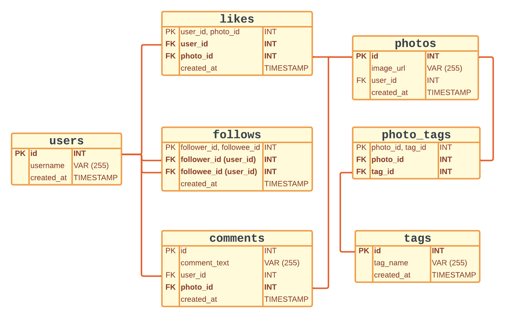

---

### 🛠️ Create Tables

**Pro Tip** → The reason why I create users and photos tables prior to the other tables is that they rely on users and photos tables.

**Pro Tip** → Use `user_id` and `photo_id` / `follower_id` and `followee_id`as  combinations of PRIMARY KEY, making sure no data is duplicated.

⚡️Check Point⚡️ 

How do I keep both post tags and photo tags from a post at the same time? 

**Pro Tips** → Create a middle table called “**photo_tags”** to keep data from an instance of a tag_name being applied to a photo in the same post.

---

<aside>
🥅 Click the Toggle “ ► ’’  on the left to expand more.

</aside>

### 🔎 Check Out Tables

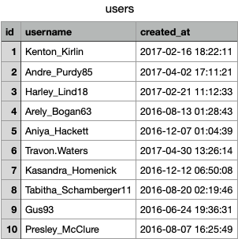

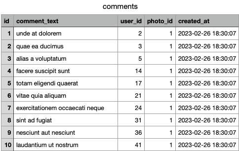

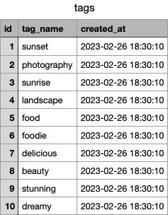

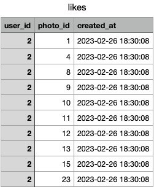

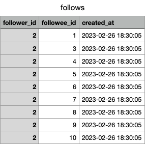

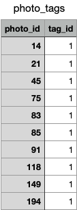

---

### Problem 1: Find out the average user post

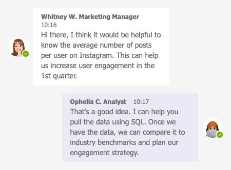

- **Request:** Help marketing manager to understand the average number of posts per user on Instagram to increase user engagement.
- **Solution:** Calculate the total number of photos and users, and determine the average number of posts per user to provide insights to stakeholders.

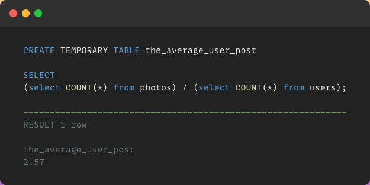

- **Insights:** The average user post is 2.57, we could further drill into which users are most likely to share content and engage with other users on Instagram, and may want to use this information to develop a more effective user acquisition or marketing strategy.

### Problem 2: Identify active users

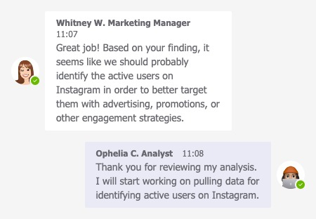

- **Request:** Help marketing manager to identify the active users on on Instagram, which users are most likely to share content and engage with other users on the platform.
- **Solution:**
    - `**COUNT**` the number of distinct photo posts made by each user and based on the previous calculation of the_average_user_post temporary table (2.57 posts per user)
    - Filter out only the "active" users who posted more frequently.
    
    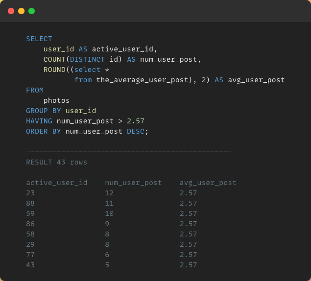
    
- **Insights:** Active users are 43 out of all 100 users, meaning more than half of the users are not active on the platform. This could suggest that identifying inactive users to increase user engagement by implementing strategies such as promotional campaigns to encourage more users to become active.

### Problem 3: Find out inactive users who have never posted a photo

- **Request:** Assist marketing manager to target out inactive users with a marketing campaign for higher engagement.
- **Solution:**
    - Use `**LEFT JOIN**` to identify where users table are not overlapping  photos table, allowing us to see the discrepancies in the data.
    - Filter out inactive users with no photo_id record by using `**IS NULL**`.
    
    
    
- **Insights:** 26% of users are inactive and have never posted a photo in the past.This presents an opportunity for our teams to target these users with personalized campaigns and incentives to encourage them to become more active on the platform.

### Problem 4: 5 oldest users whose accounts have been around the longest time duration

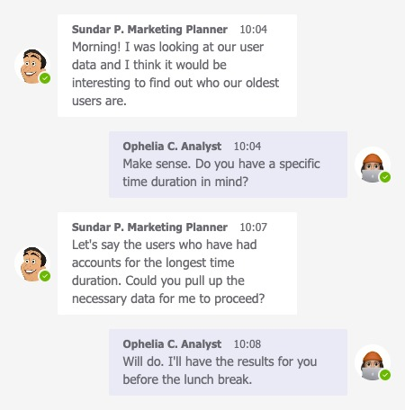

- **Request:** Identify top 5 loyal users for the marketing team member.
- **Solution:** Sorts the results by the date the account was created in ascending order, ensuring that the earliest registered users appear first.
    
    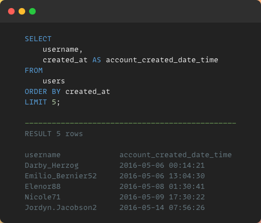
    
- **Insights:** The top 5 loyal users in terms of account creation date and time indicating that our platform has been successful in retaining users for an extended period of time. Identifying these users and understanding what keeps them engaged can help us develop retention strategies for other users.

### Problem 5: The most popular registration day of the week

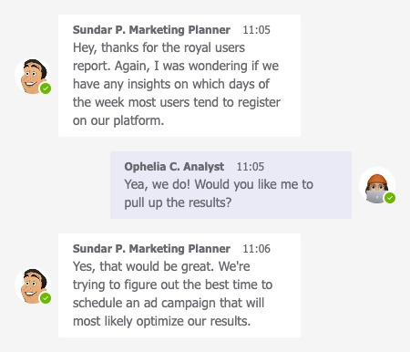

- **Request:** : What day of the weeks do most users registered on. Help marketing team to figure out when to schedule an ad campaign that will most likely optimize the result.
- **Solution:** Selects and displays top 5 days with the most user registrations, grouped by day.
    
    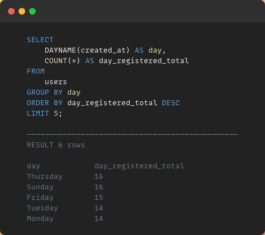
    
- **Insights:** We found that Thursday, Sunday, and Friday are the most popular days for new users to join Instagram. By leveraging this insight, the marketing team can strategically schedule ad campaigns to maximize reach and engagement during these high registration periods.

### Problem 6: Who got the most likes on a single photo?

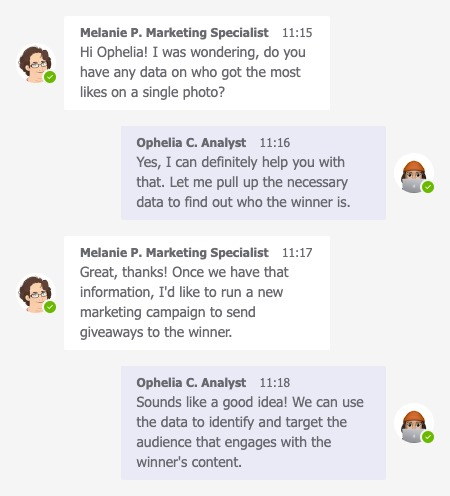

- **Request:** A new marketing campaign is to send giveaways to the winner who has the the most likes on a single photo.
- **Solution:**
    - `**INNER JOIN**` the photos table with the likes and users tables returning matching records.
    - Calculates the number of likes for each photo, groups them by photo ID, and orders them in descending order.
    - Use `**LIMIT**` to select the photo with the highest number of likes.
        
        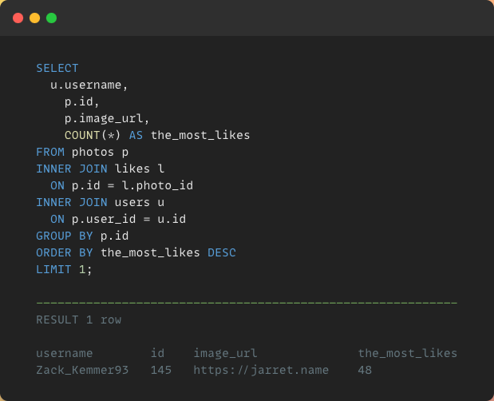
        
- **Insights:** Zack_Kemmer93's photo received 48 likes, setting a benchmark for other users to compete for the prize in the photo contest marketing campaign we launched last week.

### Problem 7: The top 3 most popular hashtags used more than 30 times

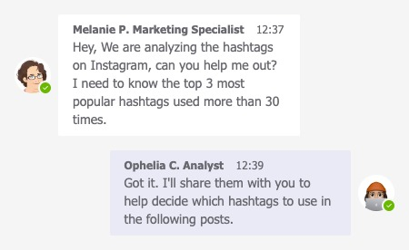

- **Request:** A marketing specialist wants to know which 3 hashtags to use in a post would be most effective.
- **Solution:**  Selects tag names used more than 30 times, grouping them and displaying the top 3 in descending order.
    
    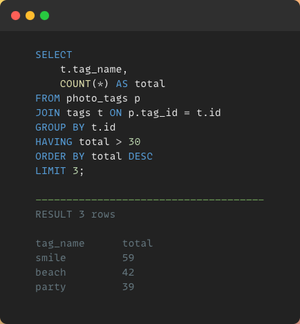
    
- **Insights:** By analyzing the data, we found that the most effective hashtags to use in a post are #smile with a total of 59, followed by #beach with 42, and #party with 39. Using these hashtags can increase engagement and reach for the post.

### **Problem 8: Who has liked every single photo on the site?**

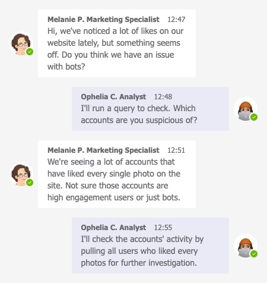

- **Request:** Solve a small problem with possible bots who have liked every single photo on Instagram.
- **Solution:**
    - When non-aggregated and aggregated fields both exists in a query, use `**GROUP BY**` to display the results.
    - Use `**HAVING**` to further filters aggregated data.
    - Use a subquery here to identify the number of all photos.
        
        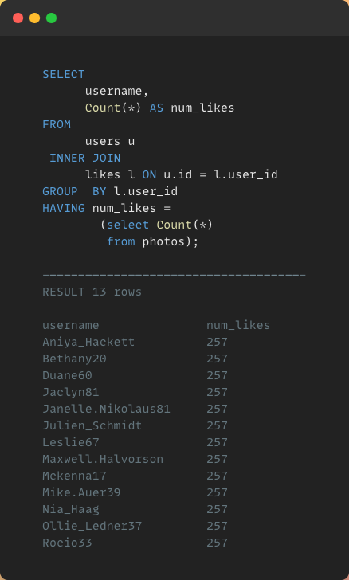
        
- **Insights:** 13 users who have liked every single photo on Instagram have been identified, with a total of 257 likes each. We can suggest look deeper into the possibility of bots or fake accounts, which can skew our engagement metrics.

### **Problem 9:**  Users' number of likes & overall ranking

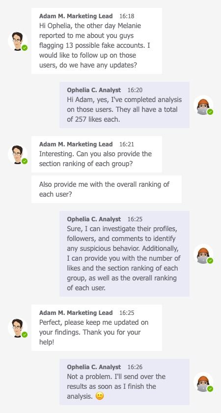

- **Request:** Marketing Lead requests to look into users’ details regarding number of likes level, the section ranking of each group, and the overall ranking of each user.
- **Solution:**
    - Use`WINDOW` functions/ `PARTITION BY`/ `RANK`/ `DENSE_RANK()`/ `ROW_NUMBER()` to achieve the desired output.
    - Retrieves user information, including ID, username, and creation date, along with the number of likes received.
    - Calculates the ranking of each user based on the number of likes received, including their overall rank and dense rank.
    - Joins the subquery of users and likes tables and then groups the result by user.
    - The **`WINDOW`** function is used to partition the data by **`PARTITION BY`**  the number of likes into groups of row.
        
        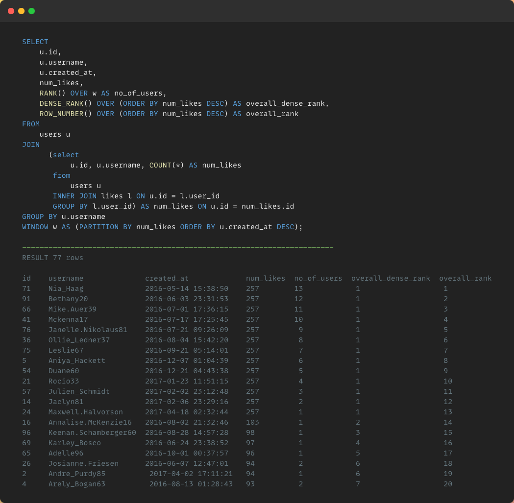
        
- **Insights:**
    - The data indicates that there are several groups of users who have liked a significant number of photos on Instagram but are not part of the highest group of 13 users. It is essential to keep track of these users' likes to measure their engagement on the platform. Moreover, the engagement metrics can be skewed if these 13 users are bots or fake accounts.
    - Among these 13 users, the top-ranked user is Nia_Haag, who has been on Instagram since May, 2016 and has liked all the photos on the platform. She is followed by Bethany20, Mike.Auer39, Mckenna17, and Janelle.Nikolaus81, who have also liked all the photos on Instagram. The least ranked among these users is Maxwell.Halvorson, who has also liked all the photos on the platform but has the least number of followers.
    - Recommend conducting a further investigation on the 13 users to identify whether they are genuine or fake accounts. This investigation should involve a closer look at their profiles, followers, and comments to understand their behavior and motive.

### **Problem 10: Users who have liked every photo with higher follower engagements and comments**

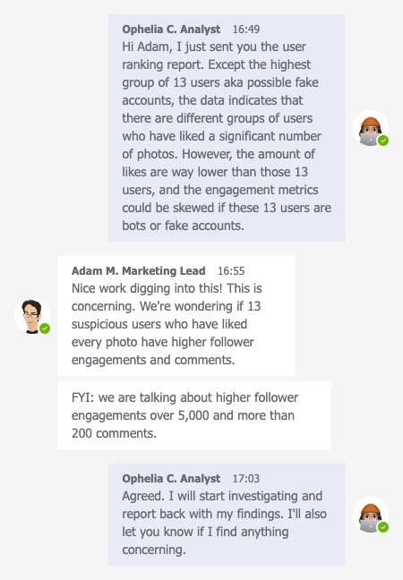

- **Request:** Find out users with more than 200 comments and higher followers engagement total above 5,000.
- **Solution:**
    - Use a **Common Table Expression** **`CTE`** to filter out popular users based on the number of followers we have in our dataset.
    - Join the users and comments tables, and calculates the total number of comments and the number of comments with higher followers engagement.
    - Sort to display only users with more than 200 comments and higher followers engagement total above 5,000.
        
        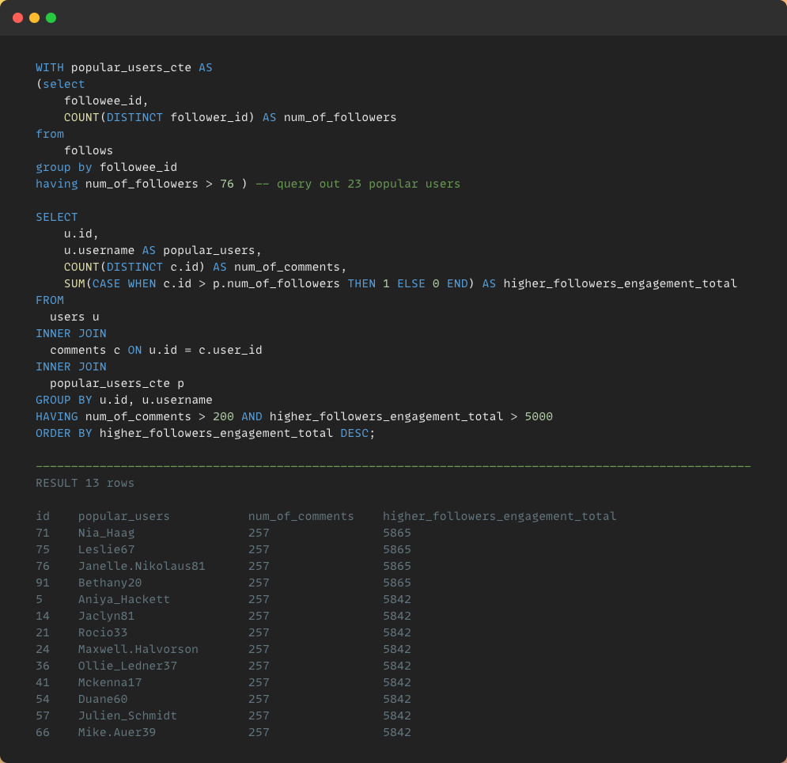
        
- **Insights:**
    - Based on the data above, the 13 users have exact equal number of comments and likes compared to their significant higher number of followers engagements. This indicates that they may not be genuine users, but rather fake accounts created for the purpose of artificially boosting engagement, which is a common tactic used by some marketers to create the appearance of popularity.
    - It is crucial to query out these 13 users’ comments and engagements to ensure that our platform maintains its integrity and provides marketing team members with accurate data. We can better understand the true level of engagement that our content is receiving and make more informed decisions by removing fake accounts to improve the quality and credibility of our company.
    

# 💁🏽‍♀️ About Me

---

*Hi there! I'm Ophelia, a post-grad business analytics student in 🇨🇦.* 

*With a background in business development, I transitioned into data in 2022 and am currently continue learning Advanced SQL, Python, Tableau and Power BI.*

**Connected With Me** 

→ [LinkedIn](https://www.linkedin.com/in/opheliandata/)

→ [Medium](https://medium.com/@fenfen201022)

→ [GitHub](https://github.com/YFC-ophey)

# 📌 More Information

---

Project PDF file created in **Notion**

Visuals created in **[Snappify](https://snappify.com/) | [Lucidchart](https://www.lucidchart.com/pages/)**

Data Analysis performed in **[MySQL](https://www.mysql.com/)**

PNG files created in **[TeamsMemes](https://www.teamsmemes.com/)**

This project is inspired by data provided with (downloaded from) **Colt Steele |** MySQL Bootcamp on Udemy
